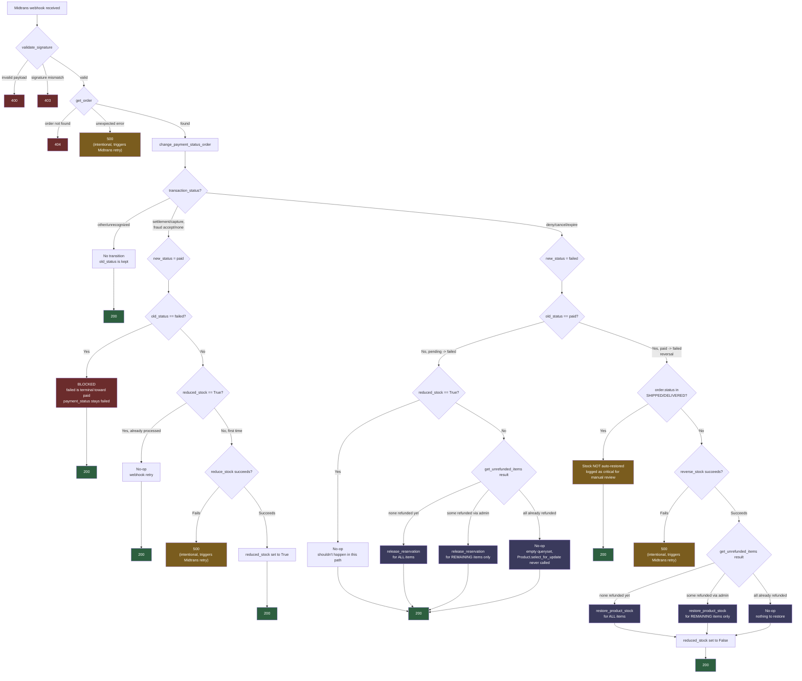

# single-vendor-ecommerce

Django/DRF e-commerce backend demonstrating concurrency-safe
checkout and payment handling: row-level locking to prevent
oversell, server-side price revalidation, and an idempotent
Midtrans webhook with automatic stock reversal on failure/expiry.

**Highlights:** race-condition-safe stock reservation
(`select_for_update`) · idempotent webhook handling ·
three-layer test suite (unit / integration / end-to-end) ·
RajaOngkir shipping integration with tiered courier selection.

## Status

The core transaction flow — checkout, then shipping rates, then
transaction, then payment webhook (non-COD) — is fully implemented
and works end-to-end for the normal case, backed by unit and
integration tests (with full three-layer coverage on the payment
webhook). Other modules (product, cart, comment) are complete
but intentionally simpler in scope.

## Worth a Look

The sections below follow the actual transaction order: checkout -> check shipping rates -> transaction -> payment webhook.

### Checkout with row-level locking

Two users checking out the same product at the same time won't
cause an oversell. During checkout, physical stock (`stock`) is
NOT decremented right away — only `reserved_stock` changes. The
reason: if `stock` were decremented immediately at checkout, and
the user never pays (checkout abandoned, session expires), that
stock would be permanently lost with no real transaction behind
it. `reserved_stock` acts as a temporary layer that can be
released again if checkout fails before payment
(`release_reservation()`), while physical `stock` is only actually
decremented after payment succeeds via the webhook
(`reduce_stock()`).

The validation itself: products are locked with
`select_for_update()` (ordered by `.order_by("id")` to prevent
deadlocks between transactions), then each item is checked against
`available_stock = product.stock - product.reserved_stock`. If the
requested `qty` exceeds `available_stock`, checkout is rejected
(`ValidationError`) before any product gets locked into the next
reservation. This way, other users' unpaid reservations are counted
as used stock too — not just the remaining physical stock.

**Known limitation:** if a checkout is simply abandoned (user
closes the tab before the 10-minute session expires, or the session
times out), the `reserved_stock` that was already added is not
automatically released — `release_reservation()` is only called via
the webhook path when Midtrans sends a `failed` status. There's no
scheduled job yet that cleans up reservations from sessions that
expired without ever reaching Midtrans, so `reserved_stock` can be
left dangling and `available_stock` ends up smaller than it should
be. This is a candidate for the next improvement (see Roadmap).

For a deeper walkthrough of the reservation pattern and the
`select_for_update()` locking logic, see the dev.to article:
[Preventing Overselling with Stock Reservation and select_for_update() in Django](https://dev.to/iqbal120708/preventing-overselling-with-stock-reservation-and-selectforupdate-in-django-3jam)

- `CheckoutService._validate_and_reserve_stock()` in
  `order/services/checkout.py`
- `CheckoutView` in `order/views_order_process.py`

### Shipping rates with automatic courier selection

After checkout, the system fetches real-time shipping options from
RajaOngkir based on total weight, item price, and store-destination
location. But the raw data from the external API isn't used as-is —
there are three processing layers before shipping options reach the
user:

1. **Filter by store's active couriers** — RajaOngkir can return
   many courier options, but a store may only partner with some of
   them (`StoreShippingOption`). Options from couriers not
   registered with the store are dropped before reaching the user.
2. **Parsing inconsistent ETD formats** — the estimated arrival
   format from RajaOngkir varies (`"3-5 day"`, `"1-2 hours"`,
   sometimes empty `"-"`). `extract_min_etd()` normalizes all of
   that into a comparable number, with an explicit fallback for
   incomplete data (instead of crashing).
3. **Tiered selection, not just cheapest** — `get_best_shipping()`
   prioritizes options with a valid ETD over those without, filters
   to COD options if the user chose COD, and only then picks the
   cheapest — with fastest ETD as a tie-breaker when prices match.

Connection failures to RajaOngkir are also handled granularly per
error type (timeout, connection error, HTTP error, invalid response
shape) — each is distinguished separately, rather than one blanket
`except Exception` that flattens every failure into one generic
message.

- `fetch_shipping_rates_from_rajaongkir()`, `get_best_shipping()`,
  `extract_min_etd()`, `get_active_shipping()` in `order/utils.py`
- `ShippingRates` in `order/views_order_process.py`

### Transaction: separating database operations from external API calls

Database operations (`OrderShippingService.execute()`, recomputing
`insurance_value` and `grand_total`, validating `gross_amount`) are
wrapped in a single `transaction.atomic()`. The call to Midtrans
(`snap.create_transaction()`) is deliberately placed OUTSIDE that
atomic block, rather than merged into one large transaction.

Reason: if both were combined into a single atomic block, a Midtrans
failure (timeout, API down) would hold the database row lock longer
than necessary, and more importantly — if an error occurs, it
wouldn't be clear which part actually failed (local data or the
external call).

By separating them: if `OrderShippingService.execute()` fails (any
exception inside the atomic block), all database changes (insurance
value, grand_total, payment_method) are cleanly rolled back — the
order returns to its pre-request state, safe to retry from scratch.
If instead `snap.create_transaction()` fails after the database part
has already committed, the next retry will recompute
`insurance_value`/`grand_total` from scratch via `update_or_create` —
but still updates the same `OrderShipping` row, rather than creating
a duplicate. The two failure modes also get different responses: 500
for internal failures (inside atomic), 502 specifically for Midtrans
upstream failures (outside atomic) — so the client knows exactly
which side failed.

- `TransactionView.post()` in `order/views_order_process.py`

### Idempotent Midtrans webhook + stock reversal

This endpoint is called by Midtrans, not the user, after payment
completes on the Snap page. Before the payload is processed, the
signature is verified: `order_id + status_code + gross_amount +
server_key` is hashed with SHA-512 and compared against the
`signature_key` sent by Midtrans — if it doesn't match, the request
is rejected (403) as a forged webhook, not a genuine one from
Midtrans.

The `payment_status` state machine blocks the `failed` -> `paid`
transition (treated as a stale notification, not a late payment),
and handles the reversal case (`paid` -> `failed`) that most webhook
tutorials skip — on this path, `reverse_stock()` is always called to
restore stock that was already deducted, and `release_reservation()`
is only added when the failure comes purely from `pending`
(checkout cancelled before payment), not from a reversal of an
already-successful payment.

Idempotency is enforced via the `reduced_stock` flag at three
different points: `reduce_stock()` (skips if already run),
`reverse_stock()` (no-op if reduce never ran), and a guard at the
view level ensuring `release_reservation()` only runs for genuinely
new failures (`pending` -> `failed`), not for reversals or duplicate
webhooks.

Order and product rows are locked again with `select_for_update()`
at this point (`get_order()`, `reduce_product_stock()`,
`restore_product_stock()`) — the same locking pattern as checkout,
reused rather than applied only once. This matters because there's a
time gap between checkout and receiving the webhook (a user may take
a few minutes to pay), and the `reserved_stock` checked at checkout
is only a soft marker, not an actual lock on physical `stock`. If an
admin manually changes `stock` during that gap (e.g. a warehouse
stock correction), `reduce_product_stock()` still revalidates
(`if product.stock < item.qty: raise ValueError`) as a second safety
net, independent of the `reserved_stock` check already passed at
checkout.

- `WebhookMidtrans` (validate_signature, get_order,
  change_payment_status_order, reduce_stock, reverse_stock,
  release_reservation) in `order/services/midtrans.py`
- `reduce_product_stock()`, `restore_product_stock()` in
  `order/utils.py`
- `MidtransWebhookView` in `order/views_order_process.py`



The most dangerous bug in this webhook wasn't visible through
normal testing — `fraud_status` being `None` (Midtrans doesn't send
this field for QRIS, bank transfer, and other non-card methods)
originally caused every one of those payments to silently fail to
update, with no error and no crash.

That was just the start. The article also covers why webhook
retries could cause stock to be deducted twice if it weren't
idempotent, a real payment reversal case that most webhook
tutorials skip (settlement can turn into deny), and a subtle bug in
the stock-reservation-release logic that took several attempts to
get right.
[Full story on the dev.to article](https://dev.to/iqbal120708/debugging-a-payment-webhook-how-i-caught-a-silent-failure-that-would-have-blocked-every-non-card-4dfi)

### Refund: per-item requests instead of order-level cancellation

`RefundRequest` is a FK to `OrderItem`, not a status on `Order` — so
one product in an order can be refunded without cancelling every
other product in the same order. Refunds are always sent manually to
the customer's bank account/e-wallet rather than automatically
through the Midtrans Refund API — some of this project's payment
methods (`bank_transfer`, `cstore`, `echannel`) don't support
automatic refunds at all.

Because the webhook reversal and an admin-initiated refund can both
process the same order almost at the same time (a realistic 1-5
minute window), both paths share a single helper,
`get_unrefunded_items()`, which excludes items whose stock has
already been restored through the other path — preventing
`reserved_stock`/`stock` from being adjusted twice for the same item.

`complete()` — the step that actually restores stock — is validated
through 4 guards before any execution, including rejecting the
combination `payment_status=PAID` + `reduced_stock=False` as an
anomalous state that needs admin review, rather than silently
processing it.

For the full design discussion (including the approaches that were
rejected), see the dev.to article: [Behind RefundRequest: Designing Item-Level Refunds for a Single-Vendor E-commerce App](https://dev.to/iqbal120708/behind-refundrequest-designing-item-level-refunds-for-a-single-vendor-e-commerce-app-e3o)

- `RefundRequest`, `RefundService` in `order/services/refund.py`

## Tech Stack

- **Framework**: Django 5.2, Django REST Framework
- **Database**: MySQL (PyMySQL as driver)
- **Auth**: dj-rest-auth + django-allauth, JWT (djangorestframework-simplejwt)
- **Payment**: Midtrans (via `midtransclient`)
- **Shipping**: RajaOngkir (direct REST API, no SDK)
- **Task queue**: Celery + Redis (async email notifications for refund status changes)
- **Other**: django-phonenumber-field (phone number validation), django-cors-headers


## Testing

Testing strategy is matched to each part of the system's risk
level, rather than applied uniformly. The checkout, shipping,
transaction, and payment webhook modules — which touch money,
stock, and third-party communication (Midtrans, RajaOngkir) — get
the strictest coverage: unit tests with mocks to isolate pure logic
from the database and external services, integration tests to
verify data structures and queries against a real database, and for
the most critical part (the payment webhook), end-to-end tests that
prove transaction rollback actually works against a real database,
not just assumed to.

Other modules (auth, product catalog, cart) are tested via
`APIClient` against a real database — sufficient to verify the
endpoints behave as expected, without a separate pure-unit-test
layer since their logic isn't as complex as the order module.

## Features

- **Authentication** — registration, login, refresh token, email
  verification (dj-rest-auth + django-allauth). Cross-user access
  is guarded by data ownership filters (orders, cart, addresses,
  comments are each only accessible by their owner) — not a
  separate role-permission system.
- **Shipping address management** — CRUD for addresses with tiered
  regions (province/city/district/sub-district)
- **Product catalog** — read-only for users; product creation/
  editing is done through Django admin, no dedicated API endpoint
  for it yet
- **Shopping cart** — add, update quantity, remove items
- **Checkout, shipping rates (RajaOngkir), transaction, and payment
  (Midtrans)** — see "Worth a Look" above
- **View & track order status** — order list with status and
  payment-status filters, per-item order detail
- **Product reviews** — comments with purchase verification
- **Refund handling** — customer-initiated per-item refund/
  cancellation requests, admin approval workflow via Django admin,
  automatic stock restoration on completion
- **Store, product, and order data managed through Django admin**

## How to run
- clone the repo
```
https://github.com/Iqbal120708/single-vendor-ecommerce/
cd single-vendor-ecommerce/ecom_store
```
- create and activate a virtual environment
```
python -m venv env
source env/bin/activate
```
- Copy `.env.example` to `.env`, then fill it in for your
environment (SECRET_KEY, MySQL credentials, Midtrans and
RajaOngkir sandbox API keys)
```
cp .env.example .env
```
- install dependencies
```
pip install -r requirements.txt
```
- Create a `logs/` folder at the repo root (one level outside
`ecom_store/`, per the `LOGGING` config in `config/settings.py`) —
the server will fail to start without this folder
```
mkdir -p ../logs
```
- (Optional) seed sample product data
```
python manage.py seed_product
```
- migrate the model
```
python manage.py makemigrations
python manage.py migrate
```
- activate the server
```
python manage.py runserver
```
- Run tests
```
python manage.py test
```

**Note:** the checkout, shipping rates, and transaction features
need your own Midtrans and RajaOngkir sandbox API keys — without
them, those endpoints will fail when tested.

## Project Structure

- **`order/`** — checkout, shipping rates, transaction, and payment
  webhook. All business constraints (stock, money, third-party
  integrations) come together here — see "Worth a Look" above for
  details.
- **`product/`** — product catalog and categories (read-only for
  users, managed through Django admin)
- **`cart/`** — per-user shopping cart
- **`shipping_address/`** — shipping addresses with tiered regions
  (province/city/district/sub-district), integrated with
  RajaOngkir for `destination_id` resolution
- **`comment/`** — product reviews with purchase verification
- **`accounts/`** — authentication (dj-rest-auth + django-allauth),
  email verification
- **`store/`** — store data, fully managed through Django admin
  (no API endpoint yet)

**Note:** this project's complexity isn't evenly distributed across
apps — `order/` holds nearly all the business logic (checkout
locking, snapshot pattern, payment state machine) because that's
where stock, money, and third-party integrations (Midtrans,
RajaOngkir) all meet at once. Other modules are intentionally
simple because their problems genuinely are simple.

Four core view classes — `CheckoutView`, `ShippingRates`,
`TransactionView`, `MidtransWebhookView` — all live in **one
file**, `order/views_order_process.py`, rather than split across
separate files. Heavy logic (locking, state machine, calculations)
is delegated to `order/services/` and `order/utils.py`; the views in
this file focus on orchestration and response handling.

## Roadmap

This project is still under active development. Some things are
deliberately left undone, not overlooked:

- **Task queue (Celery + Redis)** — now set up and used for refund
  status email notifications (see "Worth a Look"). Still planned:
  - **Cleaning up expired `reserved_stock`** — currently, if a
    checkout is abandoned before the session expires (10 minutes)
    and never reaches the Midtrans webhook, the `reserved_stock`
    already added is not automatically released. Plan: a periodic
    scheduled task that finds expired `CheckoutSession` records and
    calls `release_reservation()` for orders that were never paid.
  - **Async email notifications for non-refund order status
    changes** — paid/shipped/delivered notifications are still
    synchronous (django-allauth's built-in registration
    verification is the only other one); refund-related emails are
    the only ones on the task queue so far.
- **Admin endpoints for product, order, and store** — currently all
  admin operations (add/edit product, view all orders across
  users, manage store data) go entirely through Django admin, no
  dedicated REST API for it yet.
- **Testing in non-order modules** — modules like product, cart,
  and comment are currently tested via `APIClient` against a real
  database; there's no separate mock-based unit test layer yet like
  what's already in place for the order module, because their
  logic complexity doesn't demand it yet.
- Formal API documentation (OpenAPI/Swagger) isn't set up yet —
  the `drf-spectacular` config is prepared (commented out in
  `settings.py`) but not yet enabled and not yet in
  `requirements.txt`.
- **Translate logger messages and code comments to English** —
currently written in Indonesian; not yet updated.